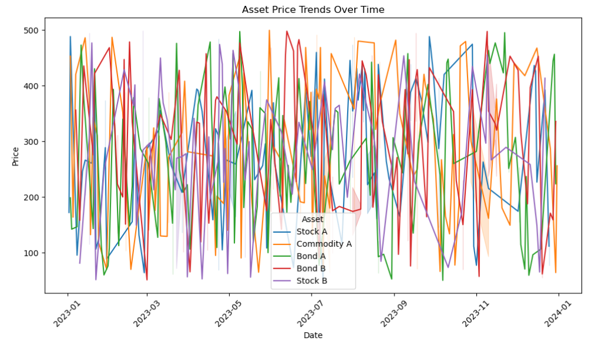

# Ex.No: 01A PLOT A TIME SERIES DATA
###  Date: 

# AIM:
To Develop a python program to Plot a time series data (population/ market price of a commodity/temperature)

# ALGORITHM:
1. Import the required packages like pandas and matplot
2. Read the dataset using the pandas
3. Calculate the mean for the respective column.
4. Plot the data according to need and can be altered monthly, or yearly.
5. Display the graph.

# PROGRAM:

Name: Sneha Basyal M

Reg no: 212222240101

```
import pandas as pd
import matplotlib.pyplot as plt
import seaborn as sns


# Load the CSV file
file_path ='financial_portfolio_data.csv'  
data = pd.read_csv(file_path)


data.head(10)


data['Date'] = pd.to_datetime(data['Date'])

# Check for duplicates
duplicates = data.duplicated().sum()

# Sorting the data by 'Date'
data = data.sort_values(by='Date')


plt.figure(figsize=(10, 6))

# Use seaborn to plot the time series for each asset
sns.lineplot(data=data, x='Date', y='Price', hue='Asset')

# Set the labels and title
plt.title('Asset Price Trends Over Time')
plt.xlabel('Date')
plt.ylabel('Price')

# Show the plot
plt.xticks(rotation=45)
plt.tight_layout()
plt.show()
```

# OUTPUT:



# RESULT:
Thus we have created the python code for plotting the time series of given data.
